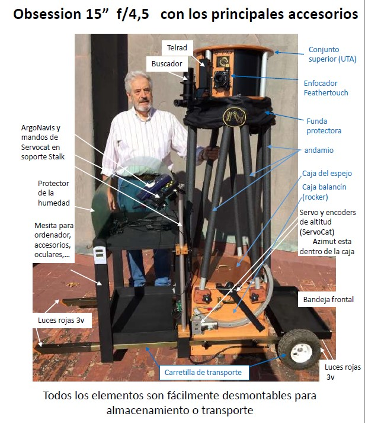

# Venta Telescopio Dobson: Obsession 15” f/4,5 Classic

* Precio global del telescopio con todos los accesorio según listado a continuación (no incluye gastos de transporte ni seguro): 5.400€
* El telescopio está en la isla de Mallorca y disponible para su examen
* Interesados contactar con Mateu: 659 460 730

## Telescopio

* Comprado directamente al fabricante en Abril de 2007 (David Kriege: <https://www.obsessiontelescopes.com>), con el registro #1299. El telescopio consiste en unidades de madera (ApplePly) y tubos de aluminio ajustados artesanalmente para máxima estabilidad y rigidez, formando el conjunto superior, tubos de andamio, caja del espejo y caja balancín.  Además se ha añadido una mesita y una bandeja frontal de madera, que se adaptan a las barras de la carretilla de transporte original. Numerosos accesorios completan este equipo en venta (ver listado).
* El equipo se halla en perfecto estado, prácticamente como nuevo gracias a un cuidado y mantenimiento riguroso y un uso limitado.
* Seguimiento y GoTo de alta precisión con ServoCAT Track y ArgoNavis DTC instalados previamente en la fábrica. Conexión con programas planetarios en PC. Es el sistema más completo y potente del mercado para este tipo de telescopios. Permite astrofotografía. Ver imágenes aquí.

* Medidas importantes:
  * Altura del ocular cuando el telescopio apunta al zenit: 167 cm.
  * Altura total: 186 cm.
  * Longitud máxima con las barras de la carretilla, incluyendo bandeja frontal: 176 cm.
  * Anchura máxima, incluyendo las ruedas de la carretilla: 81 cm.
  * Dimensiones de la parte alta (UTA): 48x25 cm. Peso 3,6 kg.
  * Longitud de los tubos de aluminio: unos 114 cm, diámetro de los tubos: 32 mm, grosor del tubo: 0,9 mm
  * Dimensiones de la parte baja: 48x53 cm
  * Peso de la caja con el espejo: 27 kg. Peso efectivo con la carretilla: 4kg.

### Espejos
* Espejo primario 15” (38,1 cm de diámetro) de altísima calidad Pyrex 7740 de sílice fundido con recocido de precisión de United Lens; fabricado por Optical Mechanics Inc. (James Mulherin), 96% de reflectividad mejorada del revestimiento de aluminio. Grosor de 5,08 cm, muy baja expansión. Longitud focal: 1.727 mm

* Espejo secundario de 66 mm (United Lens), reflectividad super-mejorada 98% a 550 nm (Brilliant-Diamond) del revestimiento multi-dieléctrico de aluminio. 1/10 de onda o mejor. Ver interferograma aquí.

* El resultado es 4 veces más brillante y 1,9 veces la resolución de un Schmidt-Cassegrain de 8” (20,32 cm). Magnitud límite: 15,5. Límite Rayleigh: 0,36 segundos de arco. Límite de contraste (diámetro mínimo antes de que una nebulosa desaparece de la vista): 5,7 minutos de arco.

* [Fotos de los espejos](espejos.md)
* [Interferometría del espejo secundario](IMG/Obs15043.pdf)

### ServoCAT Track  
* ServoCAT Track <https://www.stellarcat.com> 10.000 pasos, Gen 2, servos potentes de alta precisión, permite seguimiento en largas exposiciones y Go-To.
    * Auténtica búsqueda en espiral
    * Closed loop system with encoder feedback
    * 6 velocidades, hasta +5º/segundo
    * No requiere un PC necesariamente
    * Corrección de errores y compensación back-lash
    * Catálogos adicionales y actualizaciones gratuitas

### ArgoNavis DTC
  * GO TO con ArgoNavis DTC (Digital Telescope Computer): círculos graduados digitales +30.000 objetos y 1.100 objetos de usuario
    * Dual CPU Motorola 5206e ColdFire 40MHz 32 bit y PIC 16C505 4 MHz 8-bit microcontrolador
    * Catálogos adicionales y actualizaciones gratuitas
    * Información adicional en <http://www.wildcard-innovations.com.au/>

### Conjunto carretilla-mesa:
  * Carretilla de transporte con dos ruedas, desmontable. Original de fábrica.
  * Iluminación con bombillas rojas de 3 v en los extremos de las barras de las carretillas. 
  * Mesita para accesorios ajustada a las barras de la carretilla (63x52 cm). 
  * Columna de soporte DSC Stalk para los controlodares de Go-To, de [Markless Astronomics](https://www.marklessastronomics.com/dsc%20stalk%20products.html#dscstalk)
  * Bandeja frontal para accesorios y contrapeso en caso necesario (59x30 cm). 
  * Caja de conexiones eléctricas en el balancín (parte inferior).
  * ver imágenes aquí 
  
### Enfocador:
  * Enfocador Feathertouch, de [Starlight Instruments](https://www.starlightinstruments.com/product/ftf2015bcr-lw-lightweight-feather-touch-rotatable-2-0-focuser-with-1-5-draw-tube-travel-brake-and-compression-ring/). Gran calidad y capacidad. Enfocador rotacional con anillos de compresión, 1,5" de desplazamiento, doble velocidad y freno.
  * ve imagen aquí

### Conjunto de colimadores: 
  * Catseye 
  * Howie Glatter 
  * ver detalles [aquí](colimadores.md)
  
### Buscadores incluidos:
   * [Telrad clásico](https://www.astroshop.es/visor-de-punto-rojo-y-de-proyeccion/telrad-buscador-de-proyeccion-de-con-base/p,5974)
   * Buscador acodado 90º, 7x50, de Antares

### Otros accesorios incluidos:
  * Contrapesos para la parte posterior de la caja del espejo. Originales
  * Ventilador a 12 V, incorporado para el espejo primario. Original
  * Caja de conexiones [DewBuster](https://www.dewbuster.com/form-order-db.html) para cintas deshumificadoras en la parte alta del telescopio. Cintas no incluídas.
  * Deshumificador instalado en el secundario [Dew Guard](https://www.astrosystems.biz/dewgrd.htm) de AstroSystems, con sensor de temperatura, LED y conexiones para deshumificador. Original de fábrica.
  * Araña (https://www.astrosystems.biz/spiders.htm) y soporte de secundario (https://www.astrosystems.biz/sechold.htm) de AstroSystems Inc. Original.
  * Sistema deslizante de soporte de filtros, con cinta calefactora y caja de transporte/almacenamiento (de <https://www.astrocrumb.com>). No incluye los filtros.
  * Funda negra de Ripstop Nylon para el andamio intermedio del telescopio
  * Fundas blancas de alta protección para los componentes del telescopio, de AstroSystems (https://www.astrosystems.biz/covers.htm). Nylon 400 denier, con silicona repelente al agua y revestimiento de poliuretano en la parte interior.
  * Varios cables de conexión eléctrica
  * Manuales de usuario de los equipos
  * Ver imágenes de otros accesorios
  
## Fotos de Detalle

* [Espejos y otros accesorios](espejos-otros-accesorios.md)
* [Buscadores y Sistema GOTO](buscadores-goto.md)
* [Colimadores](colimacion.md)
* [Otras imágenes](otras-imágenes.md)
